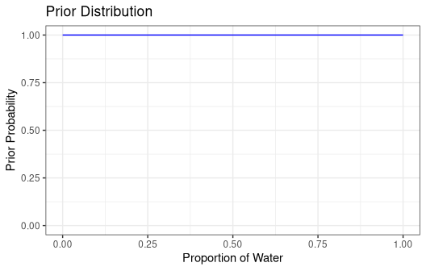
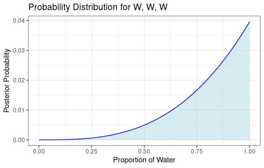
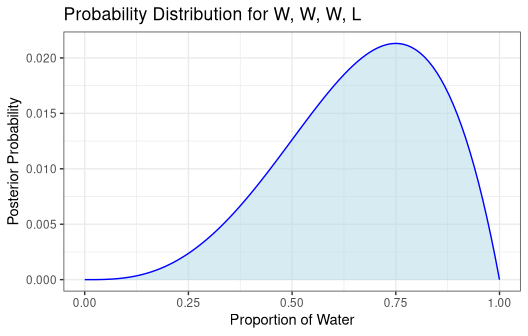
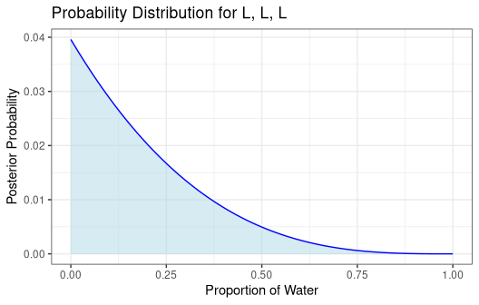

2M1: Grid Approximate Posterior with Uniform Prior
================

Recall the globe tossing model from the chapter. Compute and plot the
grid approximate posterior distribution for each of the following sets
of observations. In each case, assume a uniform prior for p.

1.  W, W, W
2.  W, W, W, L
3.  L, W, W, L, W, W, W

``` r
library(dplyr)
library(ggplot2)

n_points <- 100

# define grid
p_grid <- seq(from=0, to=1, length.out=n_points)

# define prior 
# A flat/uniform prior—every value of p is equally plausible before seeing data. 
# This is the "I have no prior information" stance.
prior <- rep(1, n_points)

# plot the prior
df_prior <- tibble(grid = p_grid, prior = prior)

ggplot(df_prior, aes(x = grid, y = prior)) +
  geom_line(color = "blue", linewidth = 0.5) +
  labs(x = "Proportion of Water", y = "Prior Probability") +
  ggtitle("Prior Distribution") +
  ylim(0, 1) +
  theme_bw()
```

<!-- -->

## W, W, W

``` r
# compute likelihood at each value in grid 
# using a binomial distribution
likelihood <- dbinom(3, size = 3, prob = p_grid)

# compute product of likelihood and prior
unstd.posterior <- likelihood * prior

# standardize the posterior, so it sums to 1
posterior <- unstd.posterior / sum(unstd.posterior)

df <- tibble(grid = p_grid, posterior = posterior)

ggplot(df, aes(x = grid, y = posterior)) +
  geom_area(fill = "lightblue", alpha = 0.5) +
  geom_line(color = "blue", linewidth = 0.5) +
  labs(x = "Proportion of Water", y = "Posterior Probability") +
  ggtitle("Probability Distribution for W, W, W") +
  theme_bw()
```

<!-- -->

## W, W, W, L

``` r
# compute likelihood at each value in grid 
# using a binomial distribution
likelihood <- dbinom(3, size = 4, prob = p_grid)

# compute product of likelihood and prior
unstd.posterior <- likelihood * prior

# standardize the posterior, so it sums to 1
posterior <- unstd.posterior / sum(unstd.posterior)

df <- tibble(grid = p_grid, posterior = posterior)

ggplot(df, aes(x = grid, y = posterior)) +
  geom_area(fill = "lightblue", alpha = 0.5) +
  geom_line(color = "blue", linewidth = 0.5) +
  labs(x = "Proportion of Water", y = "Posterior Probability") +
  ggtitle("Probability Distribution for W, W, W, L") +
  theme_bw()
```

<!-- -->

## L, W, W, L, W, W, W

``` r
# compute likelihood at each value in grid 
# using a binomial distribution
likelihood <- dbinom(5, size = 7, prob = p_grid)

# compute product of likelihood and prior
unstd.posterior <- likelihood * prior

# standardize the posterior, so it sums to 1
posterior <- unstd.posterior / sum(unstd.posterior)

df <- tibble(grid = p_grid, posterior = posterior)

ggplot(df, aes(x = grid, y = posterior)) +
  geom_area(fill = "lightblue", alpha = 0.5) +
  geom_line(color = "blue", linewidth = 0.5) +
  labs(x = "Proportion of Water", y = "Posterior Probability") +
  ggtitle("Probability Distribution for L, W, W, L, W, W, W") +
  theme_bw()
```

<!-- -->

## L, L, L

``` r
# compute likelihood at each value in grid 
# using a binomial distribution
likelihood <- dbinom(0, size = 3, prob = p_grid)

# compute product of likelihood and prior
unstd.posterior <- likelihood * prior

# standardize the posterior, so it sums to 1
posterior <- unstd.posterior / sum(unstd.posterior)

df <- tibble(grid = p_grid, posterior = posterior)

ggplot(df, aes(x = grid, y = posterior)) +
  geom_area(fill = "lightblue", alpha = 0.5) +
  geom_line(color = "blue", linewidth = 0.5) +
  labs(x = "Proportion of Water", y = "Posterior Probability") +
  ggtitle("Probability Distribution for L, L, L") +
  theme_bw()
```

<!-- -->
